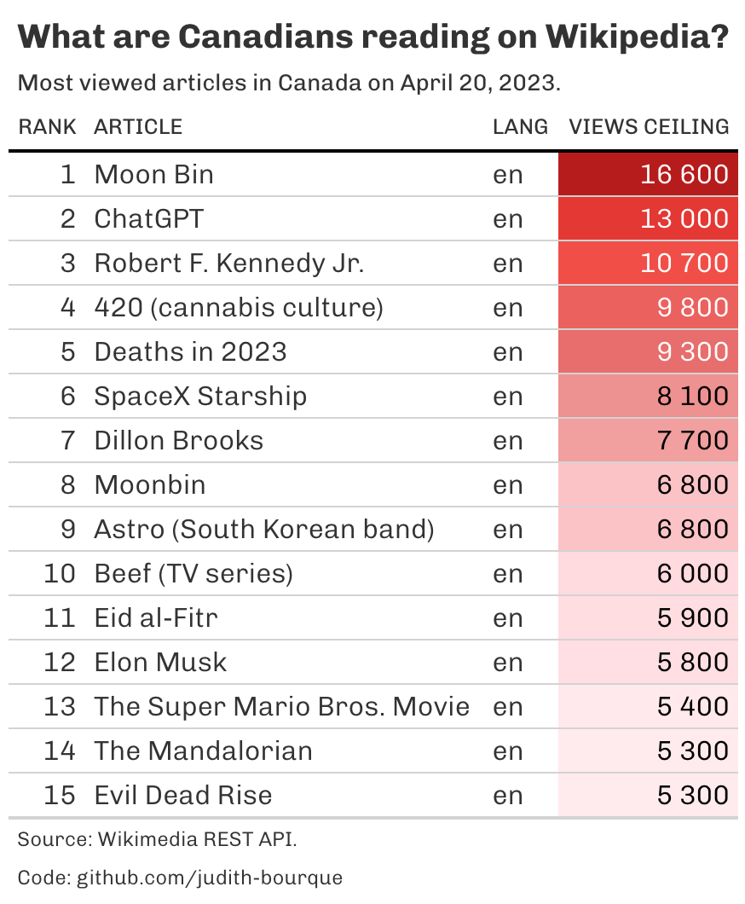

<!-- README.md is generated from README.Rmd. Please edit that file -->

```{r, include = FALSE}
knitr::opts_chunk$set(
  collapse = TRUE,
  comment = "#>",
  echo = FALSE,
  message = FALSE,
  warnings = FALSE
)
```

# render-daily

<!-- badges: start -->
<!-- badges: end -->

The goal of render-daily is to automate the rendering of a README daily and on push.

# Example

```{r}
# Description -------------------------------------------------------------
# This script creates a function that retrieves the most viewed wikipedia
# articles per country. It serves as an API wrapper for the Wikimedia REST API
# (https://wikimedia.org/api/rest_v1/).
# Function ----------------------------------------------------------------

pageviews_top_per_country <-
  function (country = "CA",
            access = "all-access",
            year = format(Sys.Date()-1, "%Y"),
            month = format(Sys.Date()-1, "%m"),
            day = format(Sys.Date()-1, "%d"),
            user_agent = Sys.getenv("WIKIMEDIA_USER_AGENT")) {
    # Get response from API
    request_result <-
      httr::GET(
        url = paste(
          "https://wikimedia.org/api/rest_v1/metrics/pageviews/top-per-country",
          country,
          access,
          year,
          month,
          day,
          sep = "/"
        ),
        config = httr::user_agent(user_agent)
      )
    
    if(httr::http_error(request_result)){
      warning("The request failed")
    } else {
      httr::content(request_result)
    }
    
    # Parse returned text with fromJSON()
    parsed <- jsonlite::fromJSON(httr::content(request_result, as = "text"))
    
    # Create dataframe
    df_untidy <- parsed[["items"]][["articles"]][[1]]
    
    # Clean article names
    df <- df_untidy %>% 
      dplyr::mutate(
        article = gsub("_", " ", article),
        date = as.POSIXct(paste(year, month, day, sep = "-"), tz = "UTC"),
        country = country,
        access = access
      )
    
    # Return dataframe
    df
  }
```


```{r}
# Load packages and functions ---------------------------------------------
library(tidyverse)
library(scales)
library(gt)
library(gtExtras)

# Load data ---------------------------------------------------------------

df <- pageviews_top_per_country(country = "CA")

# Transform data ----------------------------------------------------------

exclude <- c("Special:Search", "Main Page", "Wikipédia:Accueil principal")

# Keep top articles
df_table <- df %>% 
  # Remove pages that aren't articles
  dplyr::filter(!article %in% c("Main Page", "Special:Search", "Wikipédia:Accueil principal", "Wikipedia:Featured pictures", "Spécial:Recherche", "Portal:Current events", "Wikipedia:首页", "Wiktionary:Main Page")) %>% 
  # Create new rank column based on articles
  select(!rank) %>% 
  tibble::rowid_to_column("rank") %>% 
  # Keep top 10
  filter(rank <= 15) %>% 
  # Create language column
  separate(project, c("language", "project"), "\\.")

# Visualize data ----------------------------------------------------------

# Set parameters
yesterday <- Sys.Date()-1

year <- format(yesterday, "%Y")
month <- format(yesterday, "%B")
day <- format(yesterday, "%d")

subtitle <- paste0("Most viewed articles in Canada on ", month, " ", day, ",", " ", year, ".")

caption_1 <- paste0("Source: Wikimedia REST API.")
caption_2 <- "Code: github.com/judith-bourque"

views_min <- min(df_table$views_ceil)
views_max <- max(df_table$views_ceil)


# Create graph
gt_export <- df_table %>% 
  select(c(rank, article, language, views_ceil)) %>% 
  gt() %>% 
  cols_label(
    language = "Lang",
    views_ceil = "Views ceiling"
  ) %>% 
  # Add space in numbers
  fmt_number(views_ceil, sep_mark = " ", decimals = 0) %>% 
  tab_header(
    title = md("**What are Canadians reading on Wikipedia?**"),
    subtitle = subtitle
  ) %>% 
  gt_color_rows(views_ceil, palette = "ggsci::red_material", domain = c(views_min, views_max)) %>% 
  tab_source_note(caption_1) %>% 
  tab_source_note(caption_2) %>% 
  gt_theme_538()

# View graph
gtsave(gt_export, "graph/graph.png")



```

